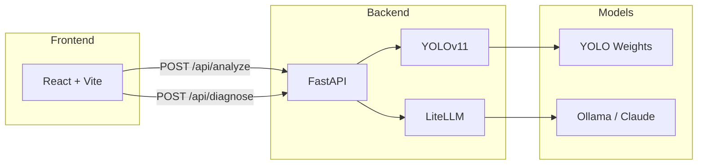

# Lazarus

**Automated PCB defect detection and repair guidance using computer vision and LLM-powered diagnostics.**

Lazarus helps electronics technicians identify and repair PCB manufacturing defects by combining YOLOv11 object detection with AI-generated repair instructions.

## The Problem

Printed Circuit Board (PCB) inspection is traditionally a manual, time-consuming process requiring experienced technicians. Automated Optical Inspection (AOI) machines exist but are expensive and often limited to pass/fail decisions without actionable repair guidance.

**Lazarus differentiates itself by**:
- Providing **repair instructions**, not just defect detection
- Using LLMs to generate context-aware diagnostic sheets
- Being **open-source** and runnable on standard hardware

**Roadmap** (not yet implemented):
- XY probe station integration for electrical continuity testing
- Automated test point generation from PCB gerber files

## Architecture



**Data flow**:
1. User uploads PCB image via web interface
2. Backend runs YOLOv11 inference, returns bounding boxes + class labels
3. User clicks a defect to request diagnosis
4. Backend sends defect context to LLM, returns repair sheet
5. User can export PDF report

## Tech Stack

| Layer | Technologies |
|-------|-------------|
| **ML / Vision** | YOLOv11 (Ultralytics), PyTorch, trained on [DsPCBSD+](https://doi.org/10.1038/s41597-024-03656-8) (9 defect classes) |
| **Backend** | FastAPI, Python 3.13, LiteLLM, Pillow, uv |
| **Frontend** | React 19, TypeScript, Vite, TailwindCSS 4, React-Konva, jsPDF |
| **LLM** | Configurable via LiteLLM: Ollama (default), Claude, OpenAI, etc. |

### Defect Classes (DsPCBSD+ dataset)
`short` · `spur` · `spurious_copper` · `open` · `mousebite` · `hole_breakout` · `conductor_scratch` · `conductor_foreign_object` · `base_material_foreign_object`

## Getting Started

### Prerequisites
- Python 3.13+
- Node.js 20+
- [uv](https://docs.astral.sh/uv/) (Python package manager)
- [Ollama](https://ollama.ai/) (optional, for local LLM inference)

### 1. Clone and install

```bash
git clone https://github.com/your-username/lazarus.git
cd lazarus

# Python dependencies
uv sync

# Frontend dependencies
cd apps/web && npm install && cd ../..
```

### 2. Download or train YOLO model

**Option A**: Use a pre-trained model (contact maintainer or train your own)

```bash
# Create symlink to your trained weights
ln -s /path/to/your/best.pt apps/api/models/best.pt
```

**Option B**: Train on DsPCBSD+ dataset

```bash
uv sync --extra ml
uv run python ml/download_dspcbsd.py  # Download dataset
uv run python ml/train_dspcbsd.py     # Train YOLOv11
ln -s ../../ml/runs/detect/dspcbsd_yolo11/weights/best.pt apps/api/models/best.pt
```

### 3. Configure LLM (optional)

Default config uses Ollama with Qwen. Edit `apps/api/config.yaml`:

```yaml
provider: "ollama"
model: "ollama/qwen2.5:7b"
base_url: "http://localhost:11434"
```

For Claude API, set `ANTHROPIC_API_KEY` and update config:

```yaml
provider: "anthropic"
model: "claude-sonnet-4-20250514"
```

### 4. Run the application

```bash
# Terminal 1: Backend
uv run uvicorn apps.api.main:app --reload

# Terminal 2: Frontend
cd apps/web && npm run dev
```

Open http://localhost:5173

## API Reference

| Endpoint | Method | Description |
|----------|--------|-------------|
| `/api/analyze` | POST | Upload PCB image, returns detected defects with bounding boxes |
| `/api/diagnose` | POST | Send defect data, returns repair sheet with steps |
| `/health` | GET | Health check, confirms model is loaded |
| `/docs` | GET | Swagger UI interactive documentation |

## Project Status

**Current state**: Proof of Concept

| Feature | Status |
|---------|--------|
| YOLO defect detection (9 classes) | Working |
| Interactive bounding box viewer | Working |
| LLM-generated repair sheets | Working |
| PDF export | Working |
| XY probe integration | Roadmap |
| Gerber file parsing | Roadmap |
| Multi-language support | Roadmap |

## Media

> Screenshots to be added


*Drag-and-drop PCB image upload*


*YOLOv11 defect detection with bounding boxes*


*AI-generated repair instructions*


*Downloadable repair report*

## Repository Structure

```
lazarus/
├── apps/
│   ├── api/                 # FastAPI backend
│   │   ├── main.py          # App entrypoint
│   │   ├── routers/         # API endpoints
│   │   ├── config.yaml      # LLM configuration
│   │   └── models/          # YOLO weights (gitignored)
│   └── web/                 # React frontend
│       └── src/
│           ├── components/  # UI components
│           ├── hooks/       # React hooks
│           └── types/       # TypeScript interfaces
├── ml/                      # ML training pipeline
│   ├── train_dspcbsd.py     # Training script
│   └── datasets/            # YOLO-formatted data (gitignored)
└── docs/                    # Documentation
```

## Contributing

This is a portfolio project but contributions are welcome. Please open an issue before submitting PRs.

## License

MIT
