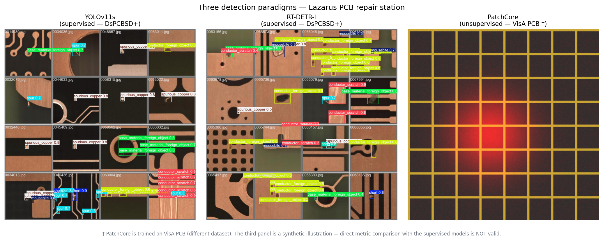
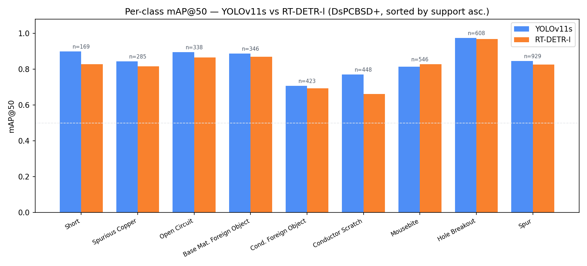
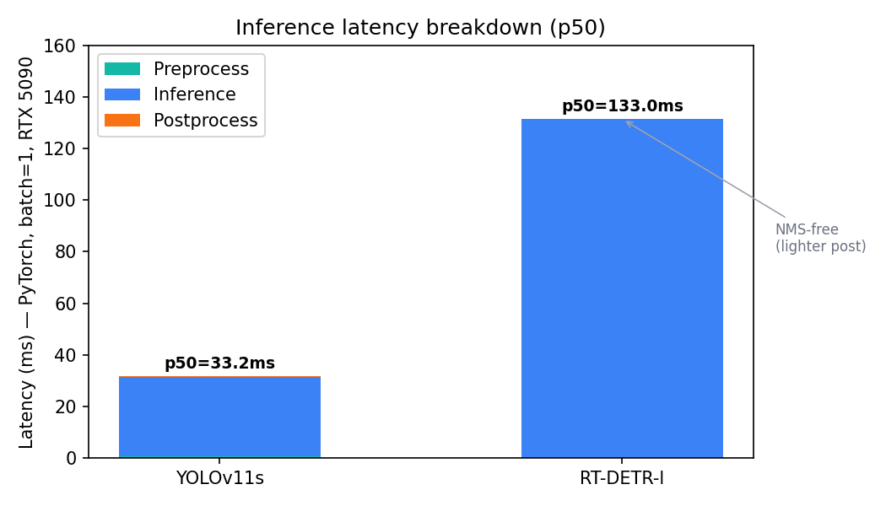
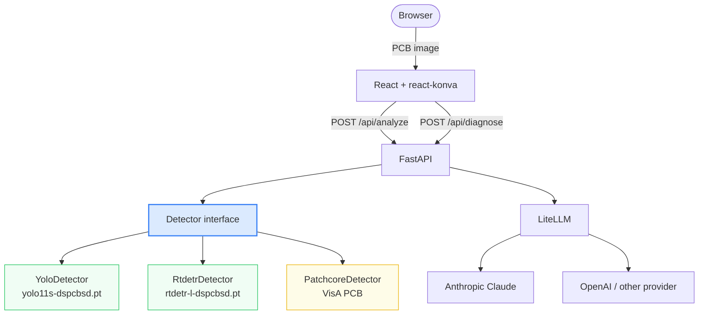

# Lazarus — PCB Defect Detection & Repair Station

Upload a PCB image, get bounding boxes on every defect, and a structured repair sheet generated by an LLM — in under two seconds.

---

<!-- MANUAL STEP: replace the placeholder below with docs/assets/demo.gif once recorded.
     See docs/assets/DEMO_RECORDING.md for the recording checklist. -->
> **Demo GIF** — see `docs/assets/DEMO_RECORDING.md` for recording instructions (only manual step).

---

## Benchmark results

Evaluated on DsPCBSD+ validation split, batch=1, RTX 5090. Full protocol in [docs/BENCHMARK.md](docs/BENCHMARK.md).

| Model | mAP@50 | mAP@50-95 | Latency p50 | Throughput | Params | Size |
|-------|--------|-----------|-------------|------------|--------|------|
| **YOLOv11s** | **0.849** | **0.550** | **33 ms** | **30 img/s** | 9.5 M | 18 MB |
| RT-DETR-l | 0.818 | 0.522 | 133 ms | 7.5 img/s | 33.0 M | 63 MB |

**Decision: YOLOv11s goes to production.** Under equal training budget and shared hyperparameters, YOLOv11s delivers +3.1 pp mAP@50, 4x lower latency, and 3.5x fewer parameters. RT-DETR-l ran as a challenger — it lost, and that result is documented rather than discarded.

---

## Three paradigms



Two supervised detectors (YOLOv11s and RT-DETR-l) were benchmarked head-to-head on DsPCBSD+, producing bounding boxes with class labels on 9 defect categories. A third approach — PatchCore, an unsupervised anomaly detector — was trained on VisA PCB boards and detects anomalies without any labelled defect examples. The two paradigms address different deployment constraints: the supervised route requires a labelled dataset and returns structured detections; the unsupervised route can be applied to any PCB without annotation cost. The panels above are **not a direct comparison** — the datasets differ.

Per-class breakdown:



Latency breakdown:



---

## Architecture

The central design principle: **the router knows only the `Detector` interface**. Swapping models requires one environment variable, no code change.



Change detector with one variable:

```bash
DETECTOR=rtdetr uv run uvicorn apps.api.main:app --reload
```

---

## Quickstart

```bash
git clone https://github.com/Alpha-Ldz/lazarus.git && cd lazarus
uv sync && cd apps/web && npm install && cd ../..
uv run uvicorn apps.api.main:app --reload &  cd apps/web && npm run dev
```

Backend: `http://localhost:8000` — Frontend: `http://localhost:5173`

---

## Reproduce the benchmark

```bash
make benchmark
```

This runs the full harness (YOLOv11s + RT-DETR-l, latency p50/p95/p99, ONNX export) and writes results to `ml/runs/benchmark_results.json`.

See [docs/BENCHMARK.md](docs/BENCHMARK.md) for the full protocol, per-class metrics, and limitations.

To regenerate all documentation figures from the JSON results:

```bash
make figures
```

---

## Stack & datasets

**Backend:** Python 3.13 · FastAPI · Ultralytics 8.4 · LiteLLM · uv
**Frontend:** React 19 · TypeScript · Vite · TailwindCSS 4 · react-konva
**ML:** PyTorch 2.11 · Anomalib (PatchCore) · ONNX Runtime

**DsPCBSD+** — 10 259 real PCB images, 9 defect classes, CC BY 4.0.
DOI: [10.1038/s41597-024-03656-8](https://doi.org/10.1038/s41597-024-03656-8)
Classes: `short`, `spur`, `spurious_copper`, `open`, `mousebite`, `hole_breakout`, `conductor_scratch`, `conductor_foreign_object`, `base_material_foreign_object`

**VisA PCB** (pcb1–pcb4) — used exclusively for PatchCore unsupervised training.
[github.com/amazon-science/spot-diff](https://github.com/amazon-science/spot-diff)

---

## Limits & future work

- **Evaluation split:** The `val` split was used for early-stopping. Reported metrics are slightly optimistic; no held-out test set exists in the current DsPCBSD+ download.
- **Equal-budget constraint:** Hyperparameters were shared between YOLOv11s and RT-DETR-l. Default Ultralytics settings are tuned for YOLO-family models; RT-DETR may improve with architecture-specific tuning.
- **RT-DETR plateau:** Best checkpoint was reached at epoch 52/150. Whether this is a dataset ceiling or a schedule mismatch is undetermined.
- **PatchCore:** Ran as dry-run (no real inference metrics). The anomaly detection branch is architectural only at this stage.
- **Not explored:** TensorRT export, backbone freeze for HGNet, model-specific LR schedules, test-time augmentation.

---

## Docs

- [Case study (FR)](docs/CASE_STUDY.md)
- [Case study (EN)](docs/CASE_STUDY.en.md)
- [Model cards](docs/MODEL_CARDS.md)
- [Benchmark details](docs/BENCHMARK.md)
- [Anomaly benchmark](docs/ANOMALY_BENCHMARK.md)
